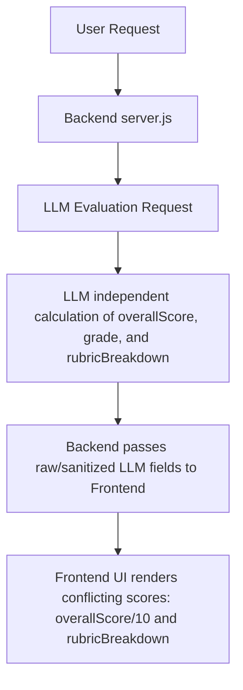
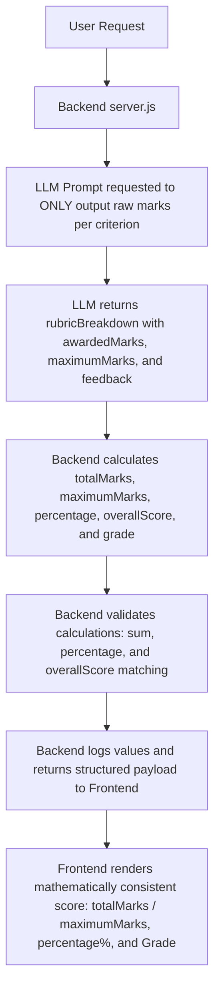

# Scoring Engine Refactor: Deterministic Evaluation Pipeline

This document details the refactoring of the scoring engine in RepoGrade to eliminate scoring inconsistencies between the individual rubric breakdown marks and the overall score displayed in the UI.

---

## 1. Root Cause

Previously, the overall score, performance grade, and rubric breakdown scores were all generated independently by the LLM (Large Large Language Model) inside its response. Since LLMs are not built for exact arithmetic calculations, they frequently generated mathematically inconsistent values:
*   The sum of individual rubric criteria scores (e.g., `14/15 + 19/20 + 19/20 + 14/15 + 9/10 + 9/10 + 9/10 = 93/100`) often did not align with the independently generated `overallScore` (e.g., `8.8`, representing `88/100`).
*   This discrepancy led to the frontend UI displaying two conflicting overall scores (e.g. `8.8/10` vs `93/100` implied by the rubric).

---

## 2. Old Scoring Flow



---

## 3. New Deterministic Scoring Flow

The backend (`server.js`) is now the single source of truth for all mathematical scoring and grading logic.



### Deterministic Rules Implemented:
1.  **Total Marks**: Calculated as the sum of all `awardedMarks` in the `rubricBreakdown`.
2.  **Maximum Marks**: Calculated as the sum of all `maximumMarks` in the `rubricBreakdown`.
3.  **Percentage**: Calculated as `Math.round((totalMarks / maximumMarks) * 100)`.
4.  **Overall Score**: Calculated as `percentage / 10`, rounded to one decimal place. This mathematically guarantees that `overallScore == percentage / 10` is always satisfied.
5.  **Grade Assignment**:
    *   `97 - 100` &rarr; **Outstanding**
    *   `90 - 96` &rarr; **Excellent**
    *   `80 - 89` &rarr; **Good**
    *   `70 - 79` &rarr; **Satisfactory**
    *   `60 - 69` &rarr; **Needs Improvement**
    *   `< 60` &rarr; **Poor**

---

## 4. Files Modified

### Backend: [server.js](file:///d:/Side%20Projects/RY/RepoGrade/backend/server.js)
*   **Prompt Schema Update**: Prohibited the LLM from returning `overallScore`, `percentage`, or `grade`. Updated the JSON response schema to return `rubricBreakdown` as an array of objects containing `criterion`, `awardedMarks` (number), `maximumMarks` (number), and `feedback` (string).
*   **Deterministic Grading Helper**: Created `getGrade(percentage)` to map percentages to grades deterministically.
*   **Calculations & Validation**: Added backend score aggregation and validation check logic that logs errors if any mathematical invariant is broken.
*   **Logging**: Implemented clear, clean logs to the server terminal showing:
    *   `Computed Total`
    *   `Maximum`
    *   `Percentage`
    *   `Overall Score`
    *   `Grade`

### Frontend: [App.jsx](file:///d:/Side%20Projects/RY/RepoGrade/src/App.jsx)
*   **Score Card Design**: Updated the overall score card to display the `totalMarks / maximumMarks` format, the `percentage%` below it, and the `grade` below that.
*   **Rubric Breakdown Rendering**: Updated the card list layout to support mapping the new structured `rubricBreakdown` array while keeping fallback support for the legacy key-value format.

---

## 5. Testing Performed

*   **API Test**: Triggered the API via PowerShell's `Invoke-RestMethod` to verify structured outputs.
*   **Validation Check**: Confirmed that the backend correctly calculates `totalMarks`, `maximumMarks`, `percentage`, `overallScore`, and `grade`, and validated that `overallScore == percentage / 10`.
*   **Console Logging Output**:
    ```
    === EVALUATION PIPELINE LOGS ===
    - Number of scanned files: 8
    - Number of files selected: 8
    - Filenames selected: [ ... ]
    --------------------------------
    Computed Total: 84
    Maximum: 100
    Percentage: 84%
    Overall Score: 8.4
    Grade: Good
    ================================
    ```

---

## 6. Before vs After Comparison

### Response Schema

#### Before (Inconsistent JSON from LLM)
```json
{
  "overallScore": 8.8,
  "grade": "Good",
  "rubricBreakdown": {
    "Project Structure": "14/15: Excellent modularity...",
    "Feature Completeness": "19/20: Implements nearly all...",
    "Git Workflow Accuracy": "19/20: Clean history...",
    "User Experience": "14/15: Smooth navigation...",
    "Documentation": "9/10: Comprehensive README...",
    "Code Quality": "9/10: Readable code...",
    "Innovation": "9/10: Creative touches..."
  }
}
```

#### After (Deterministic JSON from Backend)
```json
{
  "overallScore": 9.3,
  "totalMarks": 93,
  "maximumMarks": 100,
  "percentage": 93,
  "grade": "Excellent",
  "rubricBreakdown": [
    {
      "criterion": "Project Structure",
      "awardedMarks": 14,
      "maximumMarks": 15,
      "feedback": "Excellent modularity..."
    },
    {
      "criterion": "Feature Completeness",
      "awardedMarks": 19,
      "maximumMarks": 20,
      "feedback": "Implements nearly all..."
    },
    ...
  ],
  "strengths": [...],
  "weaknesses": [...],
  "suggestions": [...]
}
```

### Visual Score Card Display

| State | Score Card View |
| :--- | :--- |
| **Before** | **8.8 / 10**<br>⭐ Good |
| **After** | **93 / 100**<br>93%<br>⭐ Excellent |
