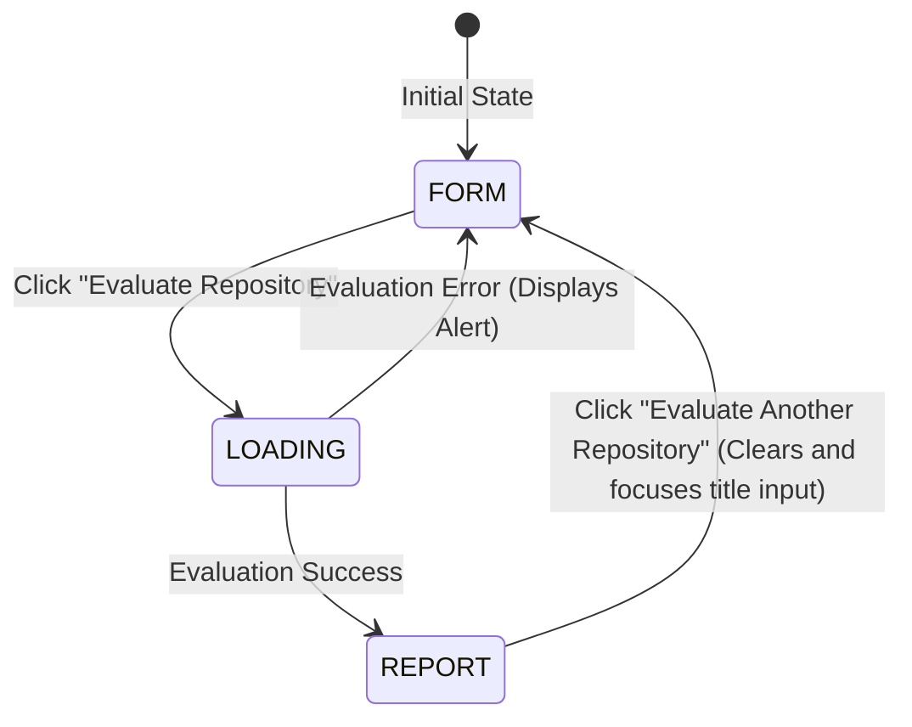

# UX Flow Refactor: State-Driven Multi-Screen Experience

This document outlines the UX transition upgrades implemented in RepoGrade, moving the application from a single scrollable form-and-report page to a structured, state-driven multi-screen experience.

---

## 1. Previous UX Flow

Previously, the application was structured on a single scrollable page:
1.  The user entered details in the form.
2.  Upon clicking **Evaluate Repository**, a small loader appeared at the bottom.
3.  When the evaluation completed, the report was appended *below* the form.
4.  This resulted in a cluttered screen, requiring the user to scroll down to view results, and keeping inputs editable/visible even after evaluation was completed.

---

## 2. New UX Flow

The application now separates the evaluation lifecycle into three distinct, mutually exclusive screens:
1.  **Form Screen (FORM)**: The initial screen showing input fields for assignment title, description, rubric, and GitHub URL.
2.  **Loading Screen (LOADING)**: A premium, focused loading screen displaying repository iconography, an animated spinner, and rotating progress messages.
3.  **Report Screen (REPORT)**: The final results dashboard showing only the computed grades and rubric feedback with an action button to restart.

---

## 3. State Diagram



---

## 4. Implementation Details

### State Machine Definition
We introduced a centralized React state `appState` inside `App.jsx` which drives conditional rendering in the root JSX block:
```javascript
const [appState, setAppState] = useState("FORM"); // "FORM", "LOADING", "REPORT"
```

### Modern Loading Experience
*   **Iconography**: Added a floating repository branch SVG to represent analysis.
*   **Spinner**: Created a CSS-animated `spin-loader` orbiting around the theme color.
*   **Rotated Progress Messages**: A `useEffect` interval rotates through the following messages every 2.5 seconds with fade-in/fade-out animations:
    *   *Fetching repository...*
    *   *Reading README...*
    *   *Downloading source files...*
    *   *Inspecting project structure...*
    *   *Evaluating implementation...*
    *   *Applying rubric...*
    *   *Generating report...*

### Reset and Scroll Focus
Added a prominent primary button **"Evaluate Another Repository"** at the bottom of the report. When clicked, it:
*   Clears the evaluation `report` data.
*   Resets all text fields (`title`, `description`, `rubric`, `githubUrl`).
*   Clears any previous error `message`.
*   Scrolls the page smoothly back to the top (`window.scrollTo`).
*   Restores the active state to `FORM` and refocuses the Assignment Title input field via a React `useRef`.

### Animations
Added lightweight CSS classes in `src/index.css` to govern screen changes:
*   `fade-in`: Animates opacity and vertical slide-in on state transitions.
*   `float-icon`: Creates a floating motion for the Git branch SVG.
*   `spin-loader`: Renders the high-performance rotation spinner.

---

## 5. Files Modified

1.  **[index.css](file:///d:/Side%20Projects/RY/RepoGrade/src/index.css)**: Appended animations for fades, floating, spinning, and transition states.
2.  **[App.jsx](file:///d:/Side%20Projects/RY/RepoGrade/src/App.jsx)**: Refactored state variables, handled message rotation, reset callbacks, refs, and rewritten JSX rendering blocks.
